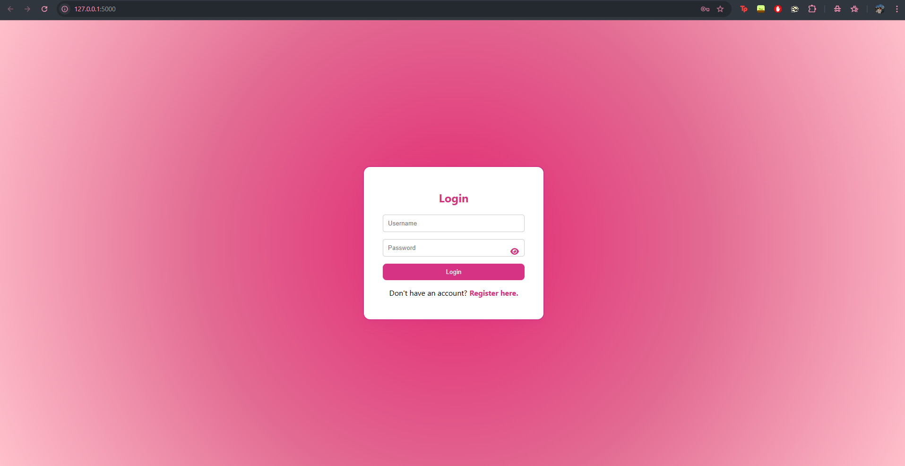
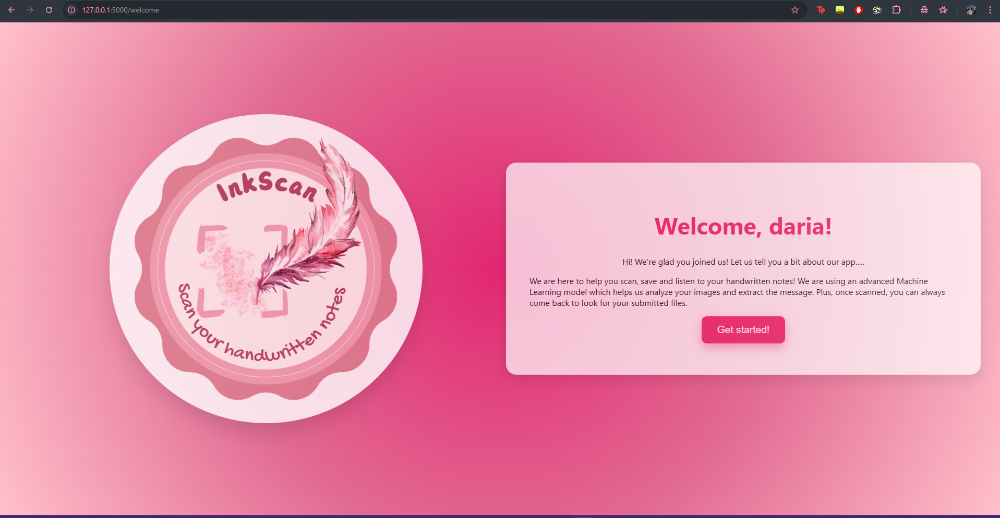
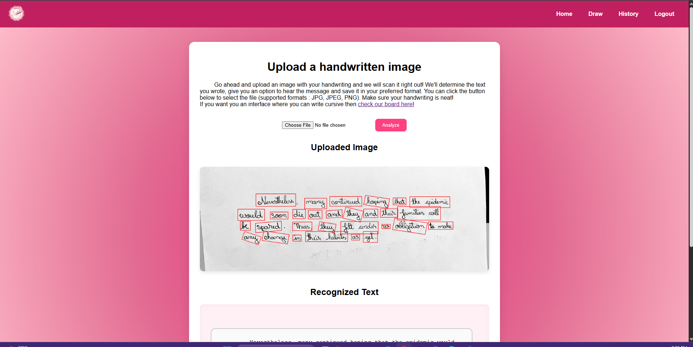
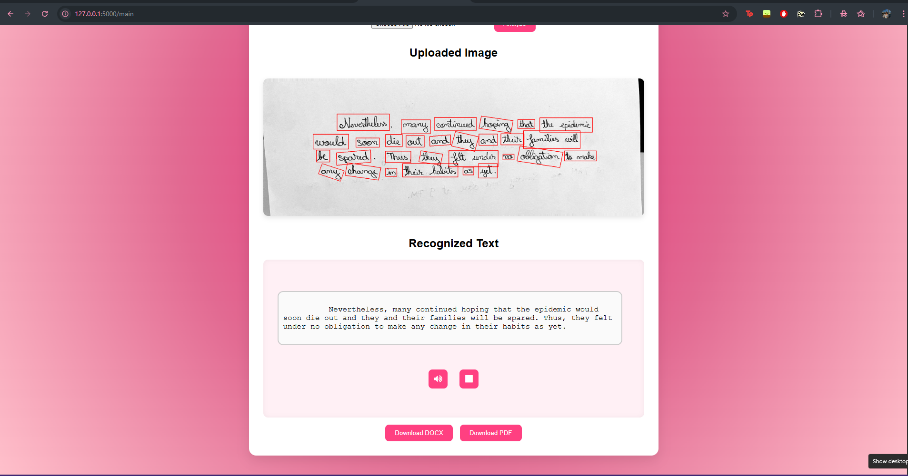
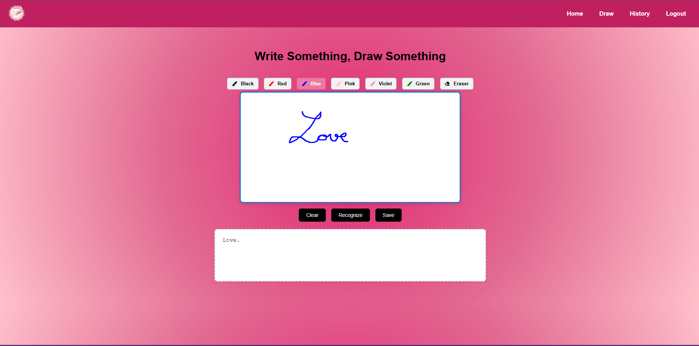
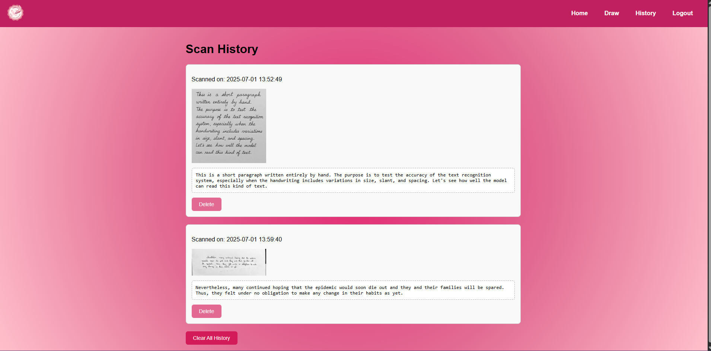

# InkScan - Features

This project is a web application for recognizing handwritten text from images. The main features are:

- **User authentication and registration**  
  Users can create accounts, log in, and log out.

- **Upload handwritten images**  
  Users can upload images (JPG, JPEG, PNG) containing handwritten text for analysis.

- **Image rotation correction**
  The app finds the angle of rotation of the uploaded picture and corrects it, using the orientation of the handwritten text.

- **Handwriting recognition from images**  
  The application automatically extracts handwritten text from images using advanced OCR models.

- **Automatic text correction**  
  The recognized text is cleaned and automatically corrected.

- **Text-to-speech**  
  Users can listen to the recognized text using speech synthesis functionality.

- **Download results**  
  The recognized text can be downloaded in DOCX or PDF format.

- **Scan history**  
  Each user has access to their history of uploaded images and recognized texts, with options to delete individual entries or clear the entire history.

- **Drawing interface**  
  Users can write by hand directly in the application on a whiteboard, and the drawn text is recognized and processed similarly to uploaded images.

- **Save drawing with watermark**  
  You can download drawings with a personalized watermark.

These features provide a complete experience for digitizing and managing handwritten text, also serving as an efficient way to store data, especially for students.

---

## Technologies Used

- **Flask** – Web framework for Python.
- **OpenCV** – Image processing and manipulation.
- **EasyOCR** – For word detection and bounding box extraction.
- **TrOCR (Transformers OCR)** – Handwriting recognition using Microsoft's TrOCR model (`microsoft/trocr-large-handwritten`).
- **Pytesseract** – For orientation and script detection.
- **TextBlob** & **language_tool_python** – For automatic text correction.
- **wordninja** – For splitting concatenated words.
- **ReportLab** & **python-docx** – For exporting recognized text as PDF and DOCX.
- **Speech Synthesis (Web Speech API)** – For text-to-speech in the browser.
- **Pillow (PIL)** – Image manipulation and watermarking.
These technologies ensure accurate OCR, robust text correction, and a user-friendly experience.

## Interface

# **1.Login and Sign up** 
Firstly, each user must create an account or connect to an existing one in order to use the app.

# **2.Welcome page**
After authentication, the user is greeted by an intermediate page where the site logo is displayed and some information about the app itself. Pressing the "Get started!" button takes you to the main page.

# **3.Main page**
On this page, you can upload a photo and after analyzing, the app will extract the text from the uploaded file. Then, you can listen to the message, download it as either PDF or DOCX, or simply keep on scanning files. You can also navigate towards other pages or log out.

# **4.Draw**
This page provides you, the user, with a whiteboard, where you can draw or write cursive freely, using a variety of colors. The app can also recognize the text you write in this interface and save it with our watermark as PNG. 

# **5.History**
Here, you can view your scanning history, sorted by date. You can choose to delete individual items or clear the entire history.

## Full Documentation 
Check out the full documentation on this project **[📄here](additional_materials/Documentatie_DudunaDaria.pdf)**
